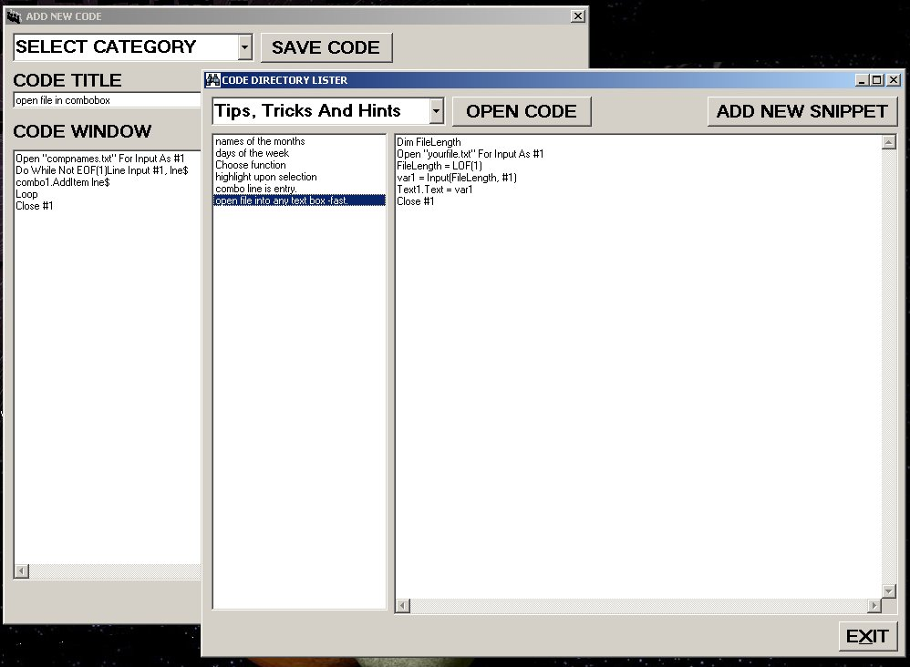



## Code Snippet

### Description

Updated app: added 1 button select and copy code display for added functionality, once again nothing fancy - plain and simple and easy to follow

Small application for organising VB code and then viewing it

If like me you write bits of code then save it for a rainy day when it will be useful and then forget where you have saved it, this is the program for you.

Written without any dll's or ocx's a plain and simple app.

I like it and use it - try it and see what you think
 
### More Info
 
type or paste into textboxes

saves textbox input and will display saved files

             |
---                |---
**Submitted On**   |2007-01-01 22:28:28
**By**             |[caver dave](https://github.com/Planet-Source-Code/PSCIndex/blob/master/ByAuthor/caver-dave.md)
**Level**          |Beginner
**User Rating**    |5.0 (15 globes from 3 users)
**Compatibility**  |VB 6\.0
**Category**       |[Complete Applications](https://github.com/Planet-Source-Code/PSCIndex/blob/master/ByCategory/complete-applications__1-27.md)
**World**          |[Visual Basic](https://github.com/Planet-Source-Code/PSCIndex/blob/master/ByWorld/visual-basic.md)
**Archive File**   |[Code\_Snipp204045122007\.zip](https://github.com/Planet-Source-Code/caver-dave-code-snippet__1-67527/archive/master.zip)

### API Declarations

see code

